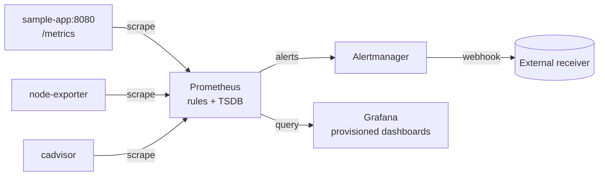

# Monitoring Stack

[](https://github.com/yashyaadav/monitoring_stack/actions/workflows/stack-smoke.yml)
[](LICENSE)


A Prometheus + Grafana + Alertmanager observability stack you can clone and exercise end-to-end in under a minute. Built as a DevOps/SRE portfolio piece — production-shaped, not production-ready.

## What's inside

- **Instrumented Go service** with `/api/{fast,slow,error,flaky}` endpoints, a histogram, a counter, and an in-flight gauge — enough variety to make dashboards interesting and fire a real burn-rate alert.
- **Docker Compose stack** (Prometheus 2.55, Grafana 11.2, Alertmanager 0.27, node-exporter, cadvisor, app) — every image pinned, every service healthchecked.
- **Three hand-built Grafana dashboards** provisioned from JSON — app RED, host + containers, Prometheus self-monitoring. No copy-pasted community imports.
- **~10 alert rules** across host / container / app categories, including a multi-window multi-burn-rate SLO alert from the Google SRE workbook.
- **Alertmanager config** with severity-based routing and an `AppDown`-inhibits-derivatives rule.
- **GitHub Actions smoke test** — every PR boots the entire stack and asserts Prometheus targets are UP, rule groups loaded, Grafana healthy.
- **Three deployment paths** — `docker compose` (default), Kubernetes via `kube-prometheus-stack` ([k8s/](k8s/)), or single-instance AWS EC2 via Terraform ([terraform/](terraform/)).
- **Runbooks for every alert** ([docs/RUNBOOK.md](docs/RUNBOOK.md)) — the SRE artifact most demo repos skip.

## Architecture



Full diagram with component table: [docs/ARCHITECTURE.md](docs/ARCHITECTURE.md).

## 30-second quick start

```bash
git clone https://github.com/yashyaadav/monitoring_stack.git
cd monitoring_stack
cp .env.example .env
make up                # docker compose up -d --wait
make smoke             # asserts targets UP, rules loaded, Grafana healthy
```

| URL                              | What                              |
| -------------------------------- | --------------------------------- |
| http://localhost:3000            | Grafana (admin / admin)           |
| http://localhost:9090            | Prometheus                        |
| http://localhost:9093            | Alertmanager                      |
| http://localhost:8080/metrics    | Sample app metrics                |

## Fire an alert (the money shot)

```bash
make load-error   # ./scripts/load.sh error 300
```

After ~5 minutes, `AppHighErrorRate` transitions Pending → Firing in Prometheus (http://localhost:9090/alerts) and Alertmanager (http://localhost:9093). Stop the app entirely (`docker compose stop app`) and `AppDown` fires within 2 minutes, with `AppHighErrorRate`/`AppHighLatencyP95`/`AppSLOBurnRateFast` suppressed by the inhibition rule.

## Docs

| Doc                                              | What's in it                                                                |
| ------------------------------------------------ | --------------------------------------------------------------------------- |
| [ARCHITECTURE.md](docs/ARCHITECTURE.md)          | Component table, full data-flow diagram, scope decisions.                   |
| [INSTALLATION.md](docs/INSTALLATION.md)          | All three deployment paths step-by-step.                                    |
| [CONFIGURATION.md](docs/CONFIGURATION.md)        | "I want to change X" → which file to edit.                                  |
| [ALERTING.md](docs/ALERTING.md)                  | Rule catalog, routing, inhibition, wiring real receivers.                   |
| [SLOs.md](docs/SLOs.md)                          | The 99% availability SLO + multi-window burn-rate alert math.               |
| [RUNBOOK.md](docs/RUNBOOK.md)                    | One section per alert: symptoms / causes / commands / remediation.          |
| [TROUBLESHOOTING.md](docs/TROUBLESHOOTING.md)    | Common local-setup pitfalls.                                                |
| [CONTRIBUTING.md](CONTRIBUTING.md)               | Lint/test commands and the PR checklist for adding new rules.               |

## Other deployment paths

- **Kubernetes** — [k8s/](k8s/) ships a [kube-prometheus-stack](https://github.com/prometheus-community/helm-charts/tree/main/charts/kube-prometheus-stack) values file plus a `PrometheusRule` CR for the app. One `helm upgrade --install`.
- **AWS EC2** — [terraform/](terraform/) is a single-file Terraform module that provisions one EC2 instance, installs Docker, and runs the Compose stack via `user_data`. Demo-grade; explicitly not multi-env.

## Why this exists / what I learned

I built this because the previous version of this repo was a Helm-install transcript: useful as a tutorial, not as a portfolio piece. The rebuild forced me to make opinionated calls a tutorial avoids:

- **What does "production-shaped" actually look like for a demo?** Pinned image versions, healthchecks everywhere, alerts paired with runbooks, an SLO with budget math rather than a flat threshold. Not production-ready — there's no remote-write, no Loki/Tempo, no auth in front of Grafana — but every artifact is the same *shape* as its production counterpart.
- **Dashboards-as-code beats imported dashboards.** Three hand-built JSONs that I can read in a diff is more useful than thirty community imports I can't reason about.
- **Inhibition is the alert design choice that matters most.** A naive ruleset pages you 3× when one thing dies (`AppDown` + `AppHighErrorRate` + `AppSLOBurnRateFast`). The inhibit rule is the difference between an SRE setup and an alert-spam machine.
- **The runbook is the highest-signal artifact in the whole repo.** I'd rather ship 10 alerts with runbooks than 50 without.

### What I'd add next

- Loki + Promtail for the logs plane; correlate from a Grafana alert into the relevant log slice.
- Tempo for traces, with the sample app emitting OpenTelemetry spans on `/api/slow` to demonstrate trace exemplars in Prometheus histograms.
- Recording rules for the SLO SLI, mirrored in Grafana panels so dashboards and alerts read the same materialized series.
- A slow-burn companion to `AppSLOBurnRateFast` (24h / 3d windows) once the service has enough history to make slow burn meaningful.

## License

[MIT](LICENSE).
