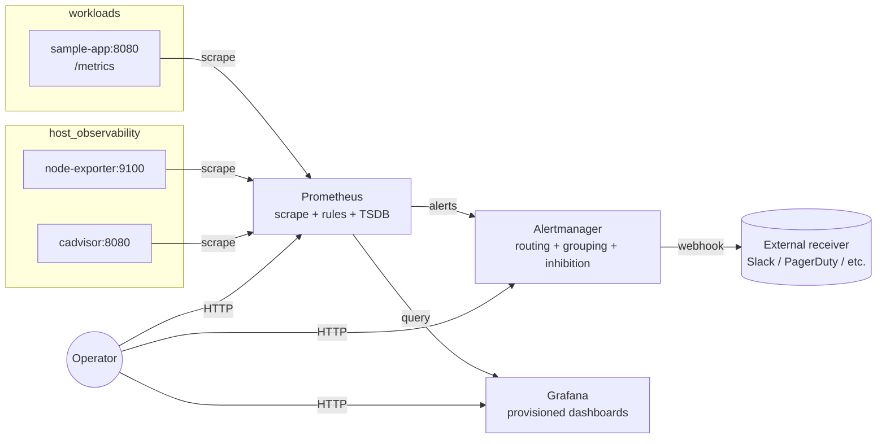

# Architecture

The stack is a metrics-only observability pipeline. Prometheus scrapes targets, evaluates rules, and forwards alerts to Alertmanager. Grafana reads Prometheus over HTTP for visualization. There is no log or trace plane — by design, see [README.md](../README.md#why-this-exists--what-i-learned).

## Components

| Component        | Role                                                                                       | Port | Image                                |
| ---------------- | ------------------------------------------------------------------------------------------ | ---- | ------------------------------------ |
| `app`            | Sample Go service. Exposes `/metrics`, `/healthz`, and four traffic-generating endpoints.  | 8080 | built from `app/Dockerfile`          |
| `prometheus`     | Scrapes all targets, evaluates alert rules, persists time series for 7d.                   | 9090 | `prom/prometheus:v2.55.1`            |
| `alertmanager`   | Receives alerts from Prometheus, applies routing/grouping/inhibition, fans out to webhook. | 9093 | `prom/alertmanager:v0.27.0`          |
| `node-exporter`  | Host-level metrics (CPU, memory, disk, network).                                           | 9100 | `prom/node-exporter:v1.8.2`          |
| `cadvisor`       | Per-container metrics (CPU, memory, restarts, network).                                    | 8080 | `gcr.io/cadvisor/cadvisor:v0.49.1`   |
| `grafana`        | Dashboard UI. Datasource and dashboards are auto-provisioned at startup.                   | 3000 | `grafana/grafana:11.2.2`             |

## Data flow

## Why these specific components

- **kube-state-metrics / cadvisor / node-exporter** are the canonical "infra layer" of a Prometheus deployment. Without them you have no host or container visibility, only application metrics. cadvisor handles the container side in the Compose path; in Kubernetes, kube-state-metrics joins the lineup ([k8s/values-kube-prometheus-stack.yaml](../k8s/values-kube-prometheus-stack.yaml)).
- **Alertmanager** is a separate process (not Prometheus itself) because alert routing, deduplication, and silencing benefit from being decoupled from the scraping/evaluation engine.
- **Grafana** is run alongside (not embedded) because the same dashboard provisioning works against any Prometheus, including the Kubernetes one — the dashboard JSON is portable.

## What's intentionally not here

- No Loki/Tempo/OpenTelemetry collector — metrics-only by scope.
- No long-term storage (Thanos, Mimir, VictoriaMetrics, remote-write) — 7d local retention is enough to demonstrate the pattern.
- No service mesh, no multi-cluster federation, no recording-rule cardinality optimization beyond the basics.

If you'd want any of those, treat them as the next chapter — they're not retrofitted into this repo.
